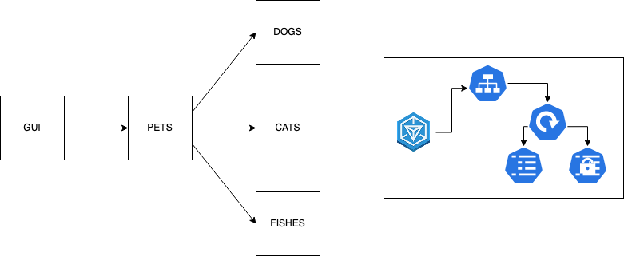

# MicroPet

## Overview

MicroPet is a MicroService Application that includes 4 components:

* `Dogs` is a service managing dogs (Go)
* `Cats` is a service managing cats (Go)
* `Fishes` is a service managing fishes (Go)
* `Pets` is a front ends service managing cats,dogs & fishes (Go)
* `Gui` is a frontend of the wonderfull application (Angular)

All the services are built into a Docker Images
All the service have deployed in a Kubernetes Cluster following the pattern:

Ingress <--> Service <--> Deployement <--> {ConfigMap,Secrets}
                                    


Note: All the procedure has tested only on Mac using

* Docker For Mac
* K3D
* Helm

## New Docker Registry

Create a new Docker Registry locally  using docker using `registry.local` as DNS name.

```bash
$k3s/new-docker-registry.sh
```

Edit your local hostname config /etc/hosts

```bash
127.0.0.1 registry.local
```

## Test the registry

```bash
docker pull containous/whoami
docker tag  containous/whoami registry.local:5000/containous/whoami:latest
docker push registry.local:5000/containous/whoami:latest
```

## New K3S Cluster

Create new K3S cluster using the docker registry created previously.

Edit `k3s/new-local-cluster.sh` and set the value for

* CLUSTER_NAME
* K3S_HOME

```bash
$k3s/new-local-cluster.sh
```

## Test k3s configuration

Apply the following configuration

```bash
kubectl apply -f k3s/test-k3s-traefik-contif.yaml
```

and check with your browser you can connect to `https://localhost:80/whoami/` or running

```bash
curl -k https://localhost:80/whoami/
```


## Deploy

### kubectl

```bash
kubectl apply -f k8s/resources-dev.yaml
kubectl delete -f k8s/resources-dev.yaml
```

```bash
K8S_NS='default'
kubectl apply -f dogs/k8s/resources-dev.yaml -n ${K8S_NS}
kubectl apply -f cats/k8s/resources-dev.yaml -n ${K8S_NS}
kubectl apply -f fishes/k8s/resources-dev.yaml -n ${K8S_NS}
kubectl apply -f pets/k8s/resources-dev.yaml -n ${K8S_NS}
kubectl apply -f gui/k8s/resources-dev.yaml -n ${K8S_NS}
```

```bash
K8S_NS='default'
kubectl delete -f dogs/k8s/resources-dev.yaml -n ${K8S_NS}
kubectl delete -f cats/k8s/resources-dev.yaml -n ${K8S_NS}
kubectl delete -f fishes/k8s/resources-dev.yaml -n ${K8S_NS}
kubectl delete -f pets/k8s/resources-dev.yaml -n ${K8S_NS}
kubectl delete -f gui/k8s/resources-dev.yaml -n ${K8S_NS}
```


### kustomize :  switch pets configuration

Switch between 2 services (dogs & cats) and 2 services (dogs, cats & fishes).

```bash
kubectl delete -k ./kustomize/overlays/2
kubectl apply -k ./kustomize/overlays/2
kubectl apply -k ./kustomize/overlays/3
kubectl apply -k ./kustomize/overlays/2
```

### new environment test

Target an existing namespace (test) and modify the Ingress resources to use `test` in it.

```bash
kubectl create ns test
kustomize build  kustomize/test | sed "s/DEV/TEST/g" | sed "s/pets.dev.pet-cluster.demo/pets.test.pet-cluster.demo/g" | kubectl apply -f -
kustomize build  kustomize/test | kubectl delete -f -
```

### Progressive deployment on Prod

Target an existing namespace (prod) and modify the Ingress resources to use `prod` in it.

```bash
kubectl create ns prod
kustomize build  kustomize/prod | sed "s/DEV/PRODUCTION/g" | sed "s/pets.dev.pet-cluster.demo/pets.prod.pet-cluster.demo/g" | kubectl apply -f -
# the pet application returns dogs & cats
open http://gui.prod.pet-cluster.demo
kubectl apply -f kustomize/prodfish/resources-dev-3.yaml -n prod
# the pet application returns dogs & cats & FISHES ==alternatively==
open http://gui.prod.pet-cluster.demo
kubectl delete -f kustomize/prodfish/resources-dev-2.yaml -n prod

# the pet application returns dogs & cats & FISHES
open http://gui.prod.pet-cluster.demo

kustomize build  kustomize/prod | kubectl delete -f -
```

Use a dedicated configuration to have the 2 versions of the pets implementation (one with fish, one without)

## Canary Deployment with istio

Install istio on your cluster

```bash
istioctl install
kubectl -n istio-system get deploy
```

Create a new namespace (canary) and enable istio

```bash
kubectl create ns canary
kubectl label namespace canary istio-injection=enabled
kubectl get namespace -L istio-injection
```

Deploy the application

```` bash
kustomize build kustomize/canary | sed "s/DEV/CANARY/g" | sed "s/pets.dev.pet-cluster.demo/pets.canary.pet-cluster.demo/g" | kubectl apply -f -
open http://gui.canary.pet-cluster.demo
````

#Maesh

```bash
$ helm repo add maesh https://containous.github.io/maesh/charts
$ helm repo update
$ helm install maesh maesh/maesh
```

curl pets-service.canary.svc.cluster.local:9000
curl pets-service.canary.svc.cluster.local:9000

## Reference

* https://blog.stack-labs.com/code/kustomize-101/
* https://kubectl.docs.kubernetes.io/references/kustomize/


