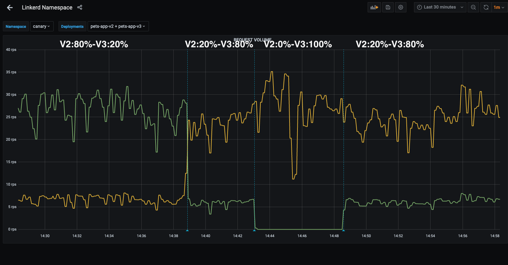
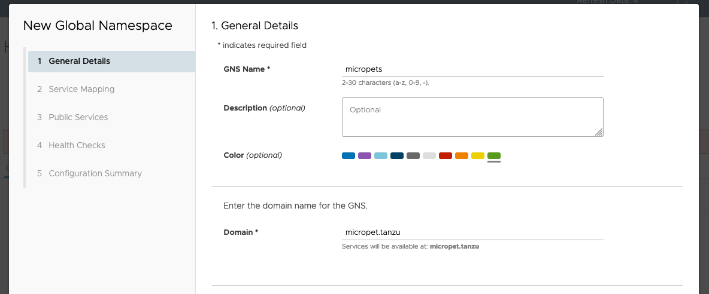
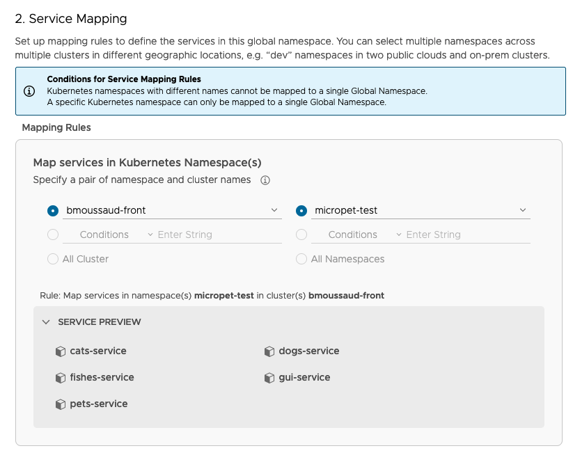
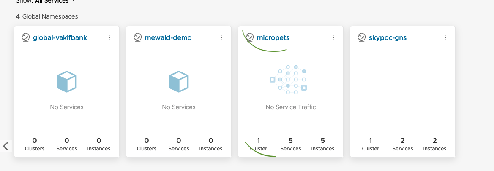
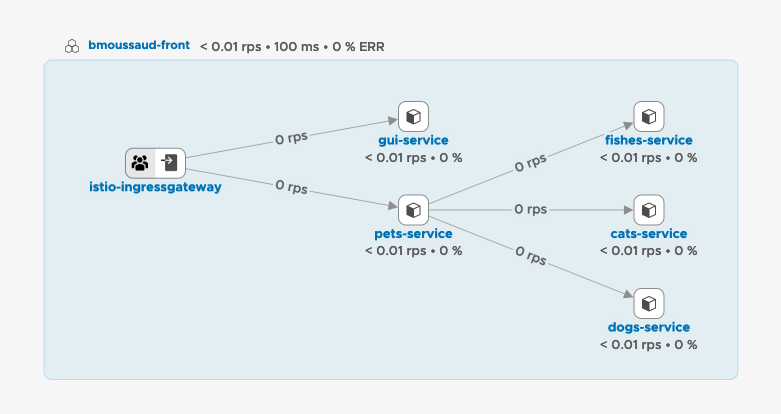
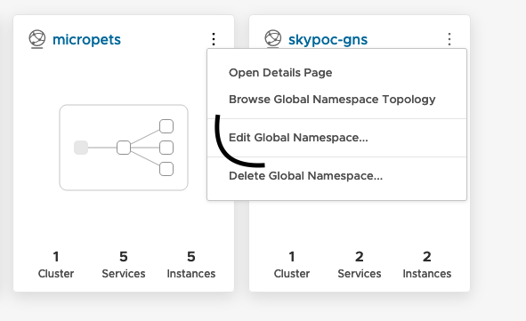
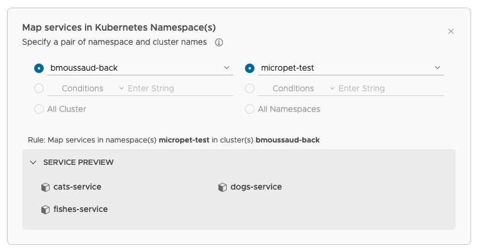
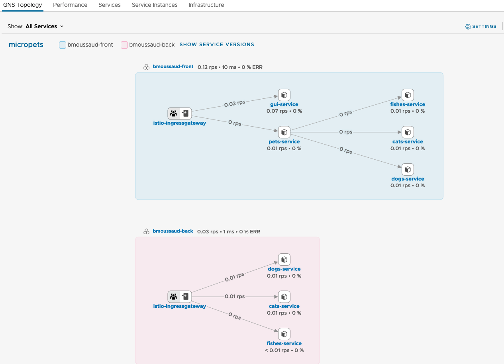

# MicroPets
www
## Overview

MicroPet is a MicroService Application that includes 4 components:

- `Dogs` is a service managing dogs (Go)
- `Cats` is a service managing cats (Go)
- `Fishes` is a service managing fishes (Go)
- `Pets` is a front ends service managing cats,dogs & fishes (Go)
- `Gui` is a frontend of the wonderfull application (Angular)


All the services are built into a Docker Images
All the service have deployed in a Kubernetes Cluster following the pattern:

Ingress <--> Service <--> Deployement <--> {ConfigMap,Secrets}


Note: All the procedure has tested only on Mac using

- Docker For Mac
- [K3D](https://k3d.io/) / [K3S](https://k3s.io/)
- Helm
- Traefik

## Setup the infrastructure

### New Docker Registry

Create a new Docker Registry locally using docker using `registry.local` as DNS name.

```bash
$./k3s/new-docker-registry.sh
```

Edit your local hostname config /etc/hosts

```bash
127.0.0.1 registry.local
```

### Test the registry

```bash
docker pull containous/whoami
docker tag  containous/whoami registry.local:5000/containous/whoami:latest
docker push registry.local:5000/containous/whoami:latest
```

### New K3S Cluster

Create new K3S cluster using the docker registry created previously.
It deploys [Helm](https://helm.sh/) & [Traefik](https://doc.traefik.io/traefik/).

Edit `k3s/Makefile` and set the value for

- CLUSTER_NAME

```bash
make create-cluster install-traefik CLUSTER_NAME=my-local-cluster
```

### Test k3s configuration

Apply the following configuration

```bash
kubectl apply -f k3s/test-k3s-traefik-contif.yaml
```

and check with your browser you can connect to `https://localhost:80/whoami/` or running

```bash
curl -k https://localhost:80/whoami/
```


## Deployments

### Deploy the Dev environment

```bash
kubectl apply -f k8s/resources-dev.yaml
kubectl delete -f k8s/resources-dev.yaml
```

#### Deploy

```bash
K8S_NS='default'
kubectl apply -f dogs/k8s/resources-dev.yaml -n ${K8S_NS}
kubectl apply -f cats/k8s/resources-dev.yaml -n ${K8S_NS}
kubectl apply -f fishes/k8s/resources-dev.yaml -n ${K8S_NS}
kubectl apply -f pets/k8s/resources-dev.yaml -n ${K8S_NS}
kubectl apply -f gui/k8s/resources-dev.yaml -n ${K8S_NS}
kubectl apply -f pets-spring/k8s/resources-dev.yaml -n ${K8S_NS}
kubectl apply -f pets-spring/k8s/resources-dev.yaml -n ${K8S_NS}
kubectl apply -f pets-spring-cloud/config-server/k8s/resources-dev.yaml -n ${K8S_NS}
```

Check the output and the status of the resources to be sure everything is ok.
It's implicit advice you have to follow after running any _kubectl_ command.
_kubectl apply_ is an asynchronous command that returns 'OK' 90% of the time because it asks the Kubernetes Cluster to change the resources' state.

open the website

```bash
open http://gui.dev.pet-cluster.demo/ or http://k8s.mytanzu.xyz/gui/
```

#### Modify the frontend

- edit `gui/src/app/pets/pets.component.css` and change one color
- commit your code
- run `cd gui && make docker-build k8s-deploy`

the Makefile handles :

- the build of the Angular application
- the build of the Docker Image,
- the deployment into the Kubernetes Cluster

#### Deploy with kustomize
kubectl apply -k dogs/k8s
kubectl apply -k cats/k8s
kubectl apply -k fishes/k8s
kubectl apply -k pets/k8s
kubectl apply -k gui/k8s

#### Undeploy

```bash
K8S_NS='default'
kubectl delete -f dogs/k8s/resources-dev.yaml -n ${K8S_NS}
kubectl delete -f cats/k8s/resources-dev.yaml -n ${K8S_NS}
kubectl delete -f fishes/k8s/resources-dev.yaml -n ${K8S_NS}
kubectl delete -f pets/k8s/resources-dev.yaml -n ${K8S_NS}
kubectl delete -f gui/k8s/resources-dev.yaml -n ${K8S_NS}
kubectl delete -f pets-spring/k8s/resources-dev.yaml -n ${K8S_NS}
kubectl delete -f pets-spring-cloud/config-server/k8s/resources-dev.yaml -n ${K8S_NS}
```

#### UnDeploy with customize
kubectl delete -k dogs/k8s
kubectl delete -k cats/k8s
kubectl delete -k fishes/k8s
kubectl delete -k pets/k8s
kubectl delete -k gui/k8s

### Switch pets configuration

Switch between 2 services (dogs & cats) and 3 services (dogs, cats & fishes).

It uses the [kustomize](https://kustomize.io/) to generate the config map and to link it to the deployment.

```bash
cd pets
kubectl delete -k ./kustomize/overlays/2
kubectl apply -k ./kustomize/overlays/2
kubectl apply -k ./kustomize/overlays/3
kubectl apply -k ./kustomize/overlays/2
```

### New environment : test

Target an existing namespace (test) and modify the Ingress resources to use `test` in it.

It uses the [kustomize](https://kustomize.io/)

- to generate the config map,
- to manage the namespace name,
- to change the Ingress URL (from ._dev_.pet-cluster.demo to ._test_.pet-cluster.demo)

```bash
kubectl create ns test
kustomize build  kustomize/test | sed "s/DEV/TEST/g" | sed "s/pets.dev.pet-cluster.demo/pets.test.pet-cluster.demo/g" | kubectl apply -f -
open http://gui.test.pet-cluster.demo/
kustomize build  kustomize/test | kubectl delete -f -
```

### Progressive deployment on Prod

Target an existing namespace (prod) and modify the Ingress resources to use `prod` in it.

```bash
kubectl create ns prod
kustomize build  kustomize/prod | sed "s/DEV/PRODUCTION/g" | sed "s/pets.dev.pet-cluster.demo/pets.prod.pet-cluster.demo/g" | kubectl apply -f -
# the pet application returns dogs & cats
open http://gui.prod.pet-cluster.demo
kubectl apply -f kustomize/prodfish/resources-dev-3.yaml -n prod
# the pet application returns dogs & cats & FISHES ==alternatively==
open http://gui.prod.pet-cluster.demo
kubectl delete -f kustomize/prodfish/resources-dev-2.yaml -n prod

# the pet application returns dogs & cats & FISHES
open http://gui.prod.pet-cluster.demo

kustomize build  kustomize/prod | kubectl delete -f -
```

Use a dedicated configuration to have the 2 versions of the pets implementation (one with fish, one without)

## Canary Deployment using Traefik

```bash
kustomize build kustomize/canary | sed "s/DEV/CANARY/g" | sed "s/pets.dev.pet-cluster.demo/pets.canary.pet-cluster.demo/g" | kubectl apply -f -
```

open http://pets.canary.pet-cluster.demo/

Inject traffic using [slow_cooker](https://github.com/BuoyantIO/slow_cooker)

```bash
./slow_cooker_darwin -qps 100 http://pets.canary.pet-cluster.demo/
```

After few minutes apply `kustomize/canary/pets_activate_20_80.yaml` to have V2 service (20%) and V3 service (80%)
After few minutes apply `kustomize/canary/pets_activate_00_100.yaml` to have V3 service (100%)

if linkerd has been installed you can look at the Grafana Dashbord showing 1/5 of the requests to the _pets_ service goes to v3 including the fishes.

```bash
linkerd dashboard &
linkerd -n canary stat deploy
```



## Gitops with Flux

Ref [https://toolkit.fluxcd.io/](https://toolkit.fluxcd.io/)
export GITHUB_TOKEN=<your-token>
export GITHUB_USER=<your-username>

flux bootstrap github \
 --owner=$GITHUB_USER \
 --repository=fleet-infra \
 --branch=main \
 --path=staging-cluster \
 --personal

this command creates or updates the `fleet-infra` personal private repository with a new path `staging-cluster` generating the flux configuration for this cluster. Then it applies them to the current cluster.

```bash
.
├── README.md
└── staging-cluster
    └── flux-system
        ├── gotk-components.yaml
        ├── gotk-sync.yaml
        └── kustomization.yaml

2 directories, 4 files
```

```bash
❯ kubectl get pods --namespace flux-system
NAME                                       READY   STATUS    RESTARTS   AGE
helm-controller-6765c95b47-nsmbz           1/1     Running   0          89s
notification-controller-694856fd64-jctjg   1/1     Running   0          89s
source-controller-5bdb7bdfc9-djxgs         1/1     Running   0          89s
kustomize-controller-7f5455cd78-jz6wc      1/1     Running   0          89s
```

Add the `micropets-app` project to be managed.

```bash
flux create source git webapp \
  --url=https://github.com/bmoussaud/micropets-app \
  --branch=master \
  --interval=30s \
  --export > ./staging-cluster/micropets-source.yaml
```

Add the `cats` projects

```bash
flux create kustomization cats \
  --source=webapp \
  --path="./cats/k8s" \
  --prune=true \
  --validation=client \
  --interval=1h \
  --export > ./staging-cluster/cats.yaml
```

Commit & push the 2 resources.

```bash
git add -A && git commit -m "add staging webapp" && git push
```

Check the cats services is now deployed on the `dev` namespace

```bash
❯ flux get kustomizations
NAME       	READY	MESSAGE                                                          	REVISION                                       	SUSPENDED
cats       	True 	Applied revision: master/5f3500cc01bb04c743d80c24162221125566168f	master/5f3500cc01bb04c743d80c24162221125566168f	False
flux-system	True 	Applied revision: main/f41fcc19c9a3c011b527e8d58feb78bf642badfd  	main/f41fcc19c9a3c011b527e8d58feb78bf642badfd  	False
```

Replicate the configuration for the following services: dogs,gui,pets

```bash
git add -A && git commit -m "add staging dogs,pets,gui" && git push
watch flux get kustomizations
```

```bash
Every 2,0s: flux get kustomizations                                                                          MacBook-Pro-de-Benoit.local:

NAME            READY   MESSAGE                                                                 REVISION                                        SUSPENDED
cats            True    Applied revision: master/5f3500cc01bb04c743d80c24162221125566168f       master/5f3500cc01bb04c743d80c24162221125566168f False
flux-system     True    Applied revision: main/5108bf3cf14826770c63ad28e13434841b40079e         main/5108bf3cf14826770c63ad28e13434841b40079e   False
dogs            True    Applied revision: master/5f3500cc01bb04c743d80c24162221125566168f       master/5f3500cc01bb04c743d80c24162221125566168f False
gui             True    Applied revision: master/5f3500cc01bb04c743d80c24162221125566168f       master/5f3500cc01bb04c743d80c24162221125566168f False
pets            True    Applied revision: master/5f3500cc01bb04c743d80c24162221125566168f       master/5f3500cc01bb04c743d80c24162221125566168f False
```

to force Flux to reconcile with repos

```bash
flux reconcile kustomization flux-system --with-source
```

The `interval` values in the kustomization resource creation tells fluxcd will check this interval to keep the configuration synchronized.
In the command line we set 1h, but it's possible to lower this value to 60s.

- Edit the cats.yaml file and set the new interval value

```yaml
interval: 60s
```

- commit and push the code
- kill the `cats` deployment object.
- wait for 60 secondes, it will come back.

## Pets Spring

[Pet-Spring](pet-spring) is another implementation of the `pets` service using the Spring Cloud Framework.
IPets has been implemented using the Go Language.
It uses the custom `config-server` stored in `pets-spring-cloud/config-server` the configuration is stored in `https://github.com/bmoussaud/sample_configuration`

## YTT (Katapult)

the [ytt](ytt) folder demoes the usage of [ytt](https://carvel.dev/ytt/) & [kapp](https://carvel.dev/kapp/) from the Carvel.dev project to generate the YAML definition of all the resources and apply them into a kubernetes namespace.

From the ytt folder, run:

- `make katapult` generates the YAML K8S resource
- `make kapp` generates the YAML K8S resource and run kapp.
- `make kdelete` deletes the application

## Tanzu Service Mesh

1. create 2 TKG clusters `aws-front` & `aws-back` with 3 worker nodes (m5.xlarge)


2. Onboard the clusters into TSM (3 steps)[doc](https://docs.vmware.com/en/VMware-Tanzu-Service-Mesh/services/getting-started-guide/GUID-DE9746FD-8369-4B1E-922C-67CF4FB22D21.html)
  * apply generic configuration
  * define the secret
  
  

  * in the TSM UI, install the TSM components.
  
  

3. Assign dns name with the clusters (/etc/hosts or DNS)
  * `front.mytanzy.xyz` to work LB in front of the `aws-front` cluster
  * `back.mytanzy.xyz` to work LB in front of the `aws-back` cluster
4. Edit `kustomize/aws/front/kustomization.yaml` and select (uncomment) the 5 services 
````
bases:
- ../../../cats/k8s
- ../../../dogs/k8s
- ../../../fishes/k8s
- ../../../gui/k8s
- ../../../pets/k8s
````
5. Edit `kustomize/aws/front/pets_config.json` and for each service, set `"host": "servicename-service"` ex `"host": "cats-service"` for cats.
6. from the root of the project, run `make deploy-front`
7. Smoke Tests
  * using curl `curl http://front.mytanzu.xyz/pets`
  * using the internet browser `http://front.mytanzu.xyz/gui/`
8. Using the TSM Console

  * Create a new Global Namespace
    * GNS Name : micropets
    * Domain: micropet.tanzu (put any name, it doesn't match with a real DNS name)
    
    

  * Select  the service mapping
    * Select the `bmoussaud-front` cluster and the `micropet-test` namespace
    * Check the list of the deployed services 
  
    

 * Public Service
    * No Public Service
  * Health Checks
    * No Public Service
  * Finish



Load few times the application using your browser `http://front.mytanzu.xyz/gui/` then click on the Cluster to get the following diagram.



9. Deploy the backend services (cats,dogs,fished) in the `aws-back` cluster : Edit `kustomize/aws/back/kustomization.yaml` and select (uncomment) the 3 services 
```
bases:
- ../../../cats/k8s
- ../../../dogs/k8s
- ../../../fishes/k8s
```
6. from the root of the project, run `make deploy-back`
7. Smoke Tests
  * using curl `curl http://back.mytanzu.xyz/cats`, `curl http://back.mytanzu.xyz/dogs` and `curl http://back.mytanzu.xyz/fishes`
8. Go into the TSM UI and check the status of the `aws-back` cluster


9. Now we'll add the `aws-back` cluster into the global namespace: Edit and modify the service mapping




10. After few access to both cluster the Global Namespace should look like this



11. Edit the `kustomize/aws/front/pets_config.json` to use Global Namespace Service Name: For each service append `.micropet.tanzu`

````
{
    "service": {
        "port": ":9000",
        "listen": "true"
    },
    "backends": [
        {
            "name": "cats",
            "host": "cats-service.micropet.tanzu",
            "port": "7002"
        },
        {
            "name": "dogs",
            "host": "dogs-service.micropet.tanzu",
            "port": "7003"
        },
        {
            "name": "pets",
            "host": "fishes-service.micropet.tanzu",
            "port": "7007"
        }
    ]
}
````

Note: Force the redeployment of the pod associated with the pets-service by killing it `kubectl delete -n micropet-test pod pets-app-6f4ccf88c8-ks6r9`

it's still working, the animal services are still available using this name !

````
$kubectl exec -n micropet-test pets-app-6f4ccf88c8-9xq9d -c pets -- curl -s http://cats-service.micropet.tanzu:7002
{"Total":2,"Hostname":"cats-app-7f4cfbb9d4-wlj7j","Pets":[{"Name":"Orphee","Kind":"Persan","Age":12,"URL":"https://www.pets4homes.co.uk/images/breeds/21/db349a9afb9b6973fa3b40f684a37bb9.jpg"},{"Name":"Pirouette","Kind":"Bengal","Age":1,"URL":"https://upload.wikimedia.org/wikipedia/commons/thumb/b/ba/Paintedcats_Red_Star_standing.jpg/934px-Paintedcats_Red_Star_standing.jpg"}]}%
````

As the services can resolved locally, the link between Pets and the 3 others services remains local.

12. Shutdown the services on the `aws-front` cluster. Go to the root project and run `make kill-front-services`

13. inject trafic in the UI 

14. Redeploy the per-animal services (cats,)


## Tanzu Build Service / kPack

Set up the project to use [Cloud Native Buildpack](https://buildpacks.io/) instead of managing Dockerfile to create the image

The project will use [kPack](https://github.com/pivotal/kpack). 
If you're looking for a supported version of kPack, please look at [Tanzu Build Service by vmware](https://tanzu.vmware.com/build-service)

Install kPack into the cluster
```
kapp deploy --yes -a kpack \
	-f https://github.com/pivotal/kpack/releases/download/v0.3.1/release-0.3.1.yaml
````

Edit [cluster/values.yaml](cluster/values.yaml) 

the cluster/kpack folder defines the cluster-scoped resources and the shared resources amongs the services

```
cd cluster
export MICROPETS_registry_password="moussaud"
export MICROPETS_into_ns="micropets-supplychain"
kubectl create  ns ${MICROPETS_into_ns}
ytt --ignore-unknown-comments --data-values-env  MICROPETS   -f . | kapp deploy --yes --into-ns ${MICROPETS_into_ns} -a micropet-kpack -f-
```

Check the builder is available (Ready=true)
```
$kubectl get ClusterBuilder micropet-builder
NAME               LATESTIMAGE                                                                                                           READY
micropet-builder   harbor.mytanzu.xyz/library/micropet-builder@sha256:dd1993c5a5550f7b91052330d11bb029bd2f108776dff5097e42e813988ae1b9   True
```

in each service project, the `kpack.yaml` file specify what to build (Image). 
Run `make deploy-cnb` to apply the definition using the current kubernetes context (at the root of the project or individually)

_undeploy everything_

kapp delete -a micropet-kpack
kubectl delete  ns ${MICROPETS_into_ns}


## Deploy with kAPP

In each service directory, there is a `k8s` directory that holds the yaml file to deployed. The configuration is based on [Kustomize](https://kustomize.io/)
There is another way to manage all these resources by grouping them into a bundle and to manage them using the same lifecycle. 
This solution is `kapp` provided by the [https://carvel.dev/ project](https://carvel.dev/)
One of the main advantage is : kapp is synchronous. It means not only kapp apply the resources but also check if the expected resources have been created or deleted.

So in each directory, there is now a `kapp` directory and in the makefile 2 new targets: `deploy-kapp` & `undeploy-kapp`

````
ytt --ignore-unknown-comments  -f kapp | kapp deploy --yes --into-ns micropets-run -a micropet-cats-service -f-
Target cluster 'https://gimckc2x2x1ar31iv6sd8124v6od-k8s-312336063.eu-west-3.elb.amazonaws.com:443' (nodes: ip-10-0-1-199.eu-west-3.compute.internal, 3+)

Changes

Namespace      Name                                                                          Kind            Conds.  Age  Op      Op st.  Wait to    Rs  Ri
micropets-run  cats-app                                                                      Deployment      -       -    create  -       reconcile  -   -
^              cats-config-2d3463f83f108599307ca86cb45545c5cb7e89c0c9219e30bdd091bd065099e2  ConfigMap       -       -    create  -       reconcile  -   -
^              cats-db-credentials                                                           Secret          -       -    create  -       reconcile  -   -
^              cats-gateway                                                                  Gateway         -       -    create  -       reconcile  -   -
^              cats-ingress                                                                  Ingress         -       -    create  -       reconcile  -   -
^              cats-service                                                                  Service         -       -    create  -       reconcile  -   -
^              cats-virtual-service                                                          VirtualService  -       -    create  -       reconcile  -   -

Op:      7 create, 0 delete, 0 update, 0 noop
Wait to: 7 reconcile, 0 delete, 0 noop

10:45:41AM: ---- applying 2 changes [0/7 done] ----
10:45:41AM: create secret/cats-db-credentials (v1) namespace: micropets-run
10:45:41AM: create configmap/cats-config-2d3463f83f108599307ca86cb45545c5cb7e89c0c9219e30bdd091bd065099e2 (v1) namespace: micropets-run
10:45:41AM: ---- waiting on 2 changes [0/7 done] ----
10:45:41AM: ok: reconcile configmap/cats-config-2d3463f83f108599307ca86cb45545c5cb7e89c0c9219e30bdd091bd065099e2 (v1) namespace: micropets-run
10:45:41AM: ok: reconcile secret/cats-db-credentials (v1) namespace: micropets-run
10:45:41AM: ---- applying 5 changes [2/7 done] ----
10:45:41AM: create ingress/cats-ingress (extensions/v1beta1) namespace: micropets-run
10:45:41AM: create virtualservice/cats-virtual-service (networking.istio.io/v1alpha3) namespace: micropets-run
10:45:41AM: create gateway/cats-gateway (networking.istio.io/v1alpha3) namespace: micropets-run
10:45:41AM: create deployment/cats-app (apps/v1) namespace: micropets-run
10:45:41AM: create service/cats-service (v1) namespace: micropets-run
10:45:41AM: ---- waiting on 5 changes [2/7 done] ----
10:45:41AM: ok: reconcile virtualservice/cats-virtual-service (networking.istio.io/v1alpha3) namespace: micropets-run
10:45:41AM: ok: reconcile ingress/cats-ingress (extensions/v1beta1) namespace: micropets-run
10:45:41AM: ok: reconcile service/cats-service (v1) namespace: micropets-run
10:45:41AM: ok: reconcile gateway/cats-gateway (networking.istio.io/v1alpha3) namespace: micropets-run
10:45:41AM: ongoing: reconcile deployment/cats-app (apps/v1) namespace: micropets-run
10:45:41AM:  ^ Waiting for generation 2 to be observed
10:45:41AM:  L ok: waiting on replicaset/cats-app-5ffd8646bb (apps/v1) namespace: micropets-run
10:45:41AM:  L ongoing: waiting on pod/cats-app-5ffd8646bb-6wtt7 (v1) namespace: micropets-run
10:45:41AM:     ^ Pending
10:45:41AM: ---- waiting on 1 changes [6/7 done] ----
10:45:42AM: ongoing: reconcile deployment/cats-app (apps/v1) namespace: micropets-run
10:45:42AM:  ^ Waiting for 1 unavailable replicas
10:45:42AM:  L ok: waiting on replicaset/cats-app-5ffd8646bb (apps/v1) namespace: micropets-run
10:45:42AM:  L ongoing: waiting on pod/cats-app-5ffd8646bb-6wtt7 (v1) namespace: micropets-run
10:45:42AM:     ^ Pending: ContainerCreating
10:45:44AM: ongoing: reconcile deployment/cats-app (apps/v1) namespace: micropets-run
10:45:44AM:  ^ Waiting for 1 unavailable replicas
10:45:44AM:  L ok: waiting on replicaset/cats-app-5ffd8646bb (apps/v1) namespace: micropets-run
10:45:44AM:  L ongoing: waiting on pod/cats-app-5ffd8646bb-6wtt7 (v1) namespace: micropets-run
10:45:44AM:     ^ Condition Ready is not True (False)
10:45:49AM: ok: reconcile deployment/cats-app (apps/v1) namespace: micropets-run
10:45:49AM: ---- applying complete [7/7 done] ----
10:45:49AM: ---- waiting complete [7/7 done] ----

Succeeded
````

It exists also a server side implementation called [`kapp-controller`](https://carvel.dev/kapp-controller/)

Install kapp-controler

````
# THIS CLUSTERROLEBINDING IS FOR DEMO PURPOSES ONLY - THIS WILL GRANT MORE PERMISSIONS THAN NECESSARY
#
kubectl create clusterrolebinding default-admin \
  --clusterrole=cluster-admin \
  --serviceaccount=default:default

kubectl create clusterrolebinding micropets-supplychain-default-admin --clusterrole=cluster-admin --serviceaccount=micropets-supplychain:default

kapp deploy --yes -a kapp-controller \
	-f https://github.com/vmware-tanzu/carvel-kapp-controller/releases/download/v0.25.0/release.yml
````

The description of the application follows this specification: https://carvel.dev/kapp-controller/docs/latest/app-spec/

````
---
apiVersion: v1
kind: ConfigMap
metadata:
  name: sample-dogs-configuration       
data:
  values.yml: |  
    service:  
      name: dogs
      mode: RANDOM_NUMBER
      port: 7003
      replicas: 1
      version: latest
      virtual_host: front.mytanzu.xyz
    registry:
      server: harbor.mytanzu.xyz/library
---
apiVersion: kappctrl.k14s.io/v1alpha1
kind: App
metadata:
  name: sample-dogs 
spec:
  serviceAccountName: default  
  fetch:
    - git:
        url: https://github.com/bmoussaud/micropets-app
        ref: master
        subPath: cluster/tap/app-operator/kapp
  template:
    - ytt:
        ignoreUnknownComments: true
        valuesFrom:
          - configMapRef:
              name: sample-dogs-configuration      
  deploy:
    - kapp:
        intoNs: another-ns1
````

````
$kubectl apply -f kapp-sample.yaml
````

## Tanzu Application Platorm

With a `ClusterSupplyChain`, app operators describe which "shape of applications" they deal with (via `spec.selector`), and what series of components are responsible for creating an artifact that delivers it (via `spec.components`).

Those `Workload`s that match `spec.selector` then go through the components specified in `spec.components`.

The `micropet-service-supply-chain` supplychain manages the backend services : dogs, cats, fishes and pets.


it includes
1. Watch a repository using `fluxcd/GitRepository`
1. Build a new image using `kpack/Image`
1. Configure the application using `kubernetes/ConfigMap`
1. Trigger a deployment using `kapp-controler/kapp` 

All theses 4 resources are described in [supply-chain-templates.yaml](cluster/tap/app-operator/supply-chain-templates.yaml) and put together in [supply-chain.yaml](cluster/tap/app-operator/supply-chain.yaml)

Then each service must provide a new workload based on this supply chain. 

The association between a workload and the requested supplychain is based using labels: 
`app.tanzu.vmware.com/workload-type`.


Example: request A new workload called `micropet-service` with the following git repository using the `RANDOM_NUMBER` mode and listening on the `7003` port.

````
apiVersion: carto.run/v1alpha1
kind: Workload
metadata:
  name: dogs
  labels:
    app.tanzu.vmware.com/workload-type: micropet-service
spec:
  source:
    git:
      url: https://github.com/bmoussaud/micropets-app/
      ref:
        branch: master      
  params:
    - name: mode
      value: "RANDOM_NUMBER"
    - name: port
      value: 7003   
````

apply this yaml definition and wacth

````
kubectl tree Workload dogs -n micropets-supplychain
Every 2,0s: kubectl tree Workload dogs -n micropets-supplychain                                                                           bmoussaud-a02.vmware.com: Fri Oct  1 16:02:08 2021

NAMESPACE              NAME                                             READY    REASON        AGE
micropets-supplychain  Workload/dogs                                    True     Ready         75s
micropets-supplychain  ├─App/dogs-application                           -                      25s
micropets-supplychain  ├─ConfigMap/micropet-service-dogs-config         -                      25s
micropets-supplychain  ├─GitRepository/micropet-dogs                    Unknown  Progressing   75s
micropets-supplychain  └─Image/micropet-dogs                            True                   70s
micropets-supplychain    ├─Build/micropet-dogs-build-1-tw6vt            -                      70s
micropets-supplychain    │ └─Pod/micropet-dogs-build-1-tw6vt-build-pod  False    PodCompleted  69s
micropets-supplychain    ├─PersistentVolumeClaim/micropet-dogs-cache    -                      70s
micropets-supplychain    └─SourceResolver/micropet-dogs-source          True                   70s

````

Several resources (kpack image, kapp-controler app, kubernetes config map, fluxcd git repository) are created and connected all together by the workload.


## References

- https://blog.stack-labs.com/code/kustomize-101/
- https://kubectl.docs.kubernetes.io/references/kustomize/
- https://tasdikrahman.me/2019/09/12/ways-to-do-canary-deployments-kubernetes-traefik-istio-linkerd/
- https://medium.com/@trlogic/linkerd-traffic-split-acf6fae3b7b8
- https://youtu.be/R6OeIgb7lUI
- https://github.com/JoeDog/siege 
- https://www.linode.com/docs/guides/load-testing-with-siege/
- https://github.com/PacktPublishing/Hands-On-Microservices-with-Spring-Boot-and-Spring-Cloud/tree/master/Chapter12
